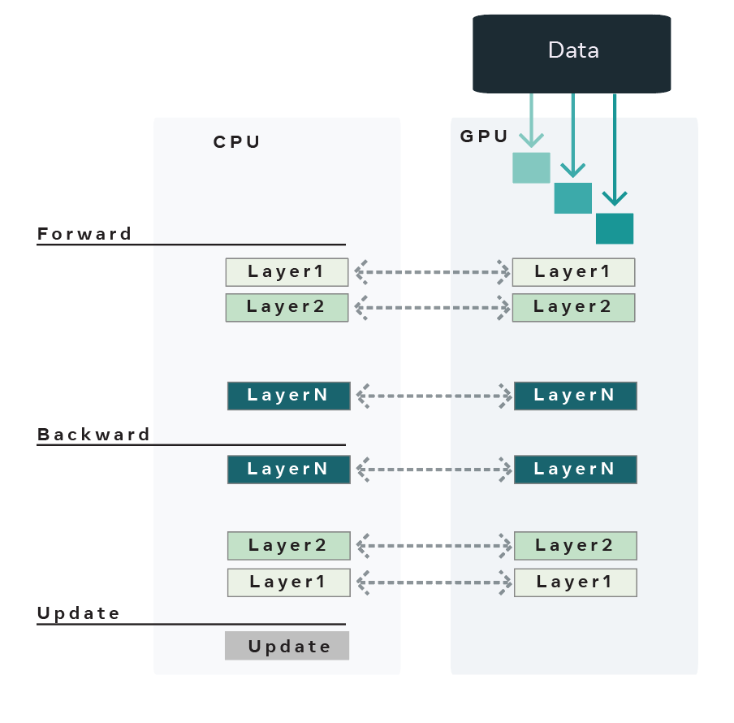

OffloadModel
=============

Heavily inspired by the `Layer-to-Layer <https://arxiv.org/abs/2002.05645>`_ algorithm and
`Zero-Offload <https://arxiv.org/abs/2101.06840>`_, OffloadModel uses the CPU to store
the entire model, optimizer state and gradients. OffloadModel then brings in a layer (or a number of
layers) onto the GPU for training at a time during the forward and backward pass. The intermediate
activations for the layer boundaries are also stored on the CPU and copied to the GPU as needed for
the backward pass. Once the backward pass is completed all the parameters are updated with the
gradients present on the CPU.

Offload uses the following techniques to enable large model training:

1. The model is assumed to be nn.Sequential and sharded (almost) equally based on the number of
parameters into a list of nn.Modules. Each nn.Module now contains a fraction of the whole model
which we shall refer to as model shards.

2. At each iteration, each of the model shards are copied from the CPU -> GPU, FW pass is computed
using the minibatch of data and the model shard is copied back from GPU -> CPU. In the BW pass, the
same process is repeated.

3. The optimizer remains on the CPU and gradients and parameters are all moved onto the CPU before
running optimizer.step. This ensures that the CPU is responsible for updating the parameters and
holding onto the optimizer state.

4. If activation checkpointing is enabled, we use torch.autograd.Function to disable graph construction
in the FW pass and copy intermediate activations from GPU -> CPU after the FW pass of a given shard is
complete. The reverse copy is carried out in the BW pass.

5. Microbatches are used to enable larger throughput and offset the cost of moving model parameters
and activations from CPU <-> GPU. Micro-batches allow you to specify large mini-batches which are
broken down into micro-batches and fed to the model shards at each iteration. In short it is a way
to allow more computation at a given time on a model shard to offset the cost of copying from CPU <-> GPU.

Best practices for using `fairscale.experimental.nn.OffloadModel`
^^^^^^^^^^^^^^^^^^^^^^^^^^^^^^^^^^^^^^^^^^^^^^^^^^^^^^^^^^^^^^^^^

1. Using OffloadModel to train large models can result in loss of throughput which can be overcome by using activation checkpointing and microbatches.

2. OffloadModel currently only works for `nn.Sequential` models.
