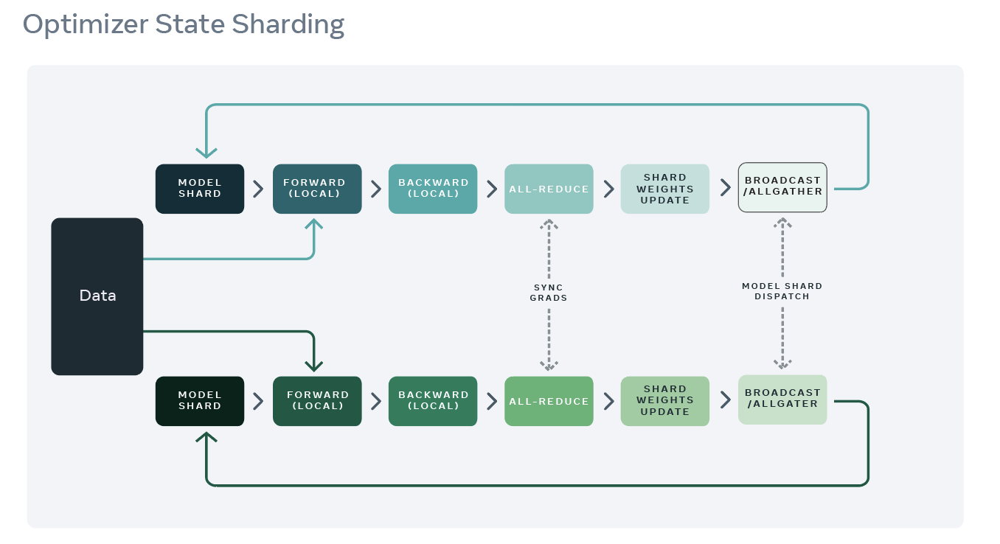
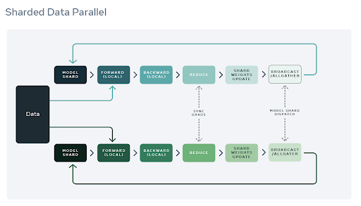
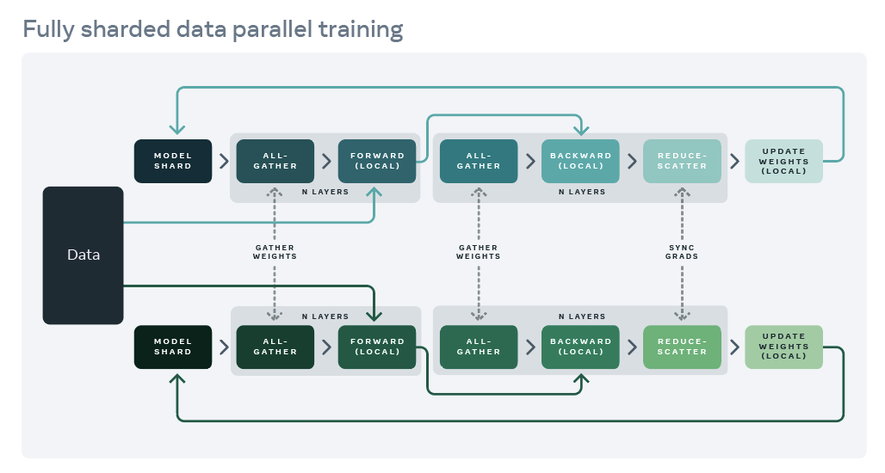

Efficient Memory management
============================

FairScale provides implementations inspired by the `ZeRO <https://arxiv.org/pdf/1910.02054.pdf>`_ class of algorithms in the form of modular
APIs that you can plug into your model training. Zero Redundancy Optimizer is a class of algorithms
that aim to tackle the tradeoff between using Data Parallel training and Model Parallel training.
When using Data Parallel training, you tradeoff memory for computation/communication efficiency.
On the other hand, when using Model Parallel training, you tradeoff computation/communication
efficiency for memory. ZeRO attempts to solve this problem. Model training generally involves memory
footprints that falls into two categories:

1. Model states - optimizer states, gradients, parameters

2. Residual states - activations, temp buffers, fragmented memory

To reduce redundancy in model states, three different algorithms were proposed. These have been
implemented in FairScale as Optimizer State Sharding (OSS), Sharded Data Parallel (SDP) and finally
Fully Sharded Data Parallel (FSDP). Let’s dive deeper into the actual mechanics of each of these
algorithms and understand why they provide the memory savings that they do.

Optimizer State Sharding (OSS)
------------------------------

FairScale has implemented memory optimization related to optimizer memory (inspired by `ZeRO-1 <https://arxiv.org/pdf/1910.02054.pdf>`_) footprint
using `fairscale.optim.OSS` API. Optimizers such as Adam usually require maintaining momentum, variance,
parameters and gradients all in FP32 precision even though training can be carried out with parameters
and gradients in FP16 precision. When each of the ranks update the full model, this means that a sizable
part of the memory is occupied by redundant representations of the optimizer state.

To overcome this redundancy, optimizer state sharding entails partitioning the model optimization step in
between the different ranks, so that each of them is only in charge of updating a unique shard of the
model. This in turn makes sure that the optimizer state is a lot smaller on each rank, and that it contains
no redundant information across ranks.

The training process can be modified from that carried out by DDP as follows:

1. The wrapped optimizer shards the optimizer state in a greedy fashion based on the parameter size but not
the order in which it is used. This is to ensure that each rank has almost the same optimizer memory
footprint.

2. The training process is similar to that used by PyTorch’s Distributed Data Parallel (DDP). The forward
pass completes on each of the ranks followed by the backward pass. During the backward pass, gradients
are synchronized using allreduce.

3. Each rank updates the parameters for the shard of optimizer state that it is responsible for and then
discards the rest.

4. After update, a broadcast or allgather follows to ensure all ranks receive the latest updated parameter
values.

OSS is very useful when you are using an optimizer such as Adam that has additional state. The wrapping
of the optimizer is a one-line non intrusive change that provides memory savings.

If you are using SGD or any optimizer with a limited memory footprint, it is likely that you will see a
slowdown when using multiple nodes, due to the additional communication in step 4. There is also some
wasteful memory used to store gradients during allreduce in step 2 that is then discarded, although this
also happens with normal PyTorch (nothing extraneous here).

Best practices for using `fairscale.optim.oss`
^^^^^^^^^^^^^^^^^^^^^^^^^^^^^^^^^^^^^^^^^^^^^^

1. OSS exposes a broadcast_fp16 flag that you should probably use in multi-node jobs, unless this leads to
accuracy issues (which is very unlikely). This can be used with or without Torch AMP. This is usually not
needed in a single node experiment.

2. If your model is extremely unbalanced in terms of size (one giant tensor for instance), then this method
will not be very helpful, and tensor sharding options such as `fairscale.nn.FullyShardedDataParallel`
would be preferable.

3. OSS should be a drop in solution in a DDP context, and stays compatible with most of the DDP features
such as the `fp16 gradient compression hook <https://pytorch.org/docs/stable/ddp_comm_hooks.html#torch.distributed.algorithms.ddp_comm_hooks.default_hooks.fp16_compress_hook>`_,
gradient accumulation and PyTorch AMP.

Performance tips for `fairscale.optim.oss`
^^^^^^^^^^^^^^^^^^^^^^^^^^^^^^^^^^^^^^^^^^

1. On a single node, OSS should be always faster than vanilla PyTorch, memory savings will vary depending
on the optimizer being used

2. When using multiple nodes, OSS can alternatively be faster or slower than vanilla PyTorch, depending
on the optimizer being used, and optional flags (E.g broadcast_fp16, gradient compression, gradient
accumulation as mentioned above.)

3. If applicable (if your experiment can do with a bigger batch size), it’s usually beneficial to reinvest
the saved memory in a larger batch size and reduce the number of ranks involved, or to use gradient
accumulation since this diminishes the communication cost.

Optimizer + Gradient State Sharding
-----------------------------------

To overcome redundant gradient memory and to enable further memory savings, gradient sharding or
`ZeRO-2 <https://arxiv.org/pdf/1910.02054.pdf>`_ was proposed. This has been implemented by the Sharded Data Parallel(SDP) API in FairScale.
While OSS solved the redundancy problem in optimizers, the above data parallel training steps revealed
a duplication of computation of gradient aggregation as well as additional memory being used for gradients
are discarded.

To enable gradient sharding, each rank is assigned a set of parameters for which they are responsible
for managing optimizer state as well as gradient aggregation. By assigning a model shard to a given
rank we ensure that gradients are reduced to specific ranks that are in turn responsible for the update.
This reduces communication as well as memory usage.

The training process is as follows:

1. As before the wrapped optimizer shards parameters across the different ranks.

2. The model is now wrapped with a Sharded Data Parallel (SDP) wrapper that allows us to add the appropriate hooks and maintain state during the training process.

3. SDP focuses on trainable parameters and adds a backward hook for each of the them.

4. During the backward pass, gradients are reduced to the rank that they are assigned to as part of the sharding process in 1. Instead of an allreduce op, a reduce op is used which reduces the communication overhead.

5. Each rank updates the parameters that they are responsible for.

6. After the update, a broadcast or allgather follows to ensure all ranks receive the latest updated parameter values.

Both the OSS and SDP APIs allow you to reduce the memory used for gradients and optimizer states.
Additional communication costs can be present in slow interconnects but are useful to try as first steps
when running into Out Of Memory (OOM) issues.

Best practices for `fairscale.nn.ShardedDataParallel`
^^^^^^^^^^^^^^^^^^^^^^^^^^^^^^^^^^^^^^^^^^^^^^^^^^^^^^

1. If using multiple nodes, make sure that SDP is using reduce buffers by specifying the
`reduce_buffer_size` arg. Changing their size can be an optimization target, the best configuration
could depend on the interconnect.

2. If on a single node, it’s usually best not to use `reduce_buffer_size` since there is a latency
cost associated with it but no memory gain. Setting this value to 0 means that this feature is not
used and this is the recommended single node setting.

3. If applicable (if your experiment can do with a bigger batch size), it’s usually beneficial to
reinvest the saved memory in a larger batch size and reduce the number of ranks involved, or to use
gradient accumulation since this diminishes the communication cost.

Optimizer + Gradient + Horizontal Model Sharding
------------------------------------------------

To further optimize training and achieve greater memory savings, we need to enable parameter sharding.
With parameter sharding similar to gradient and optimizer states, data parallel ranks are responsible
for a shard of the model parameters. FairScale implements parameter sharding by way of the Fully Sharded
Data Parallel (FSDP) API which is heavily inspired by `ZeRO-3 <https://arxiv.org/pdf/1910.02054.pdf>`_. Parameter sharding is possible because of
two key insights:

1. The allreduce operation can be broken up into reduce and allgather similar to the previous sharding
technologies (optimizer state and gradient).

2. Individual layers can be wrapped with the FSDP API that allows us to bring in all the parameters
required for a single layer onto a given GPU at a given instance, compute the forward pass and then
discard the parameters not owned by that rank. Please see the tutorial section for how you can use
autowrap to enable wrapping individual layers of your model.

The training process is as follows:

1. `allgather` the parameters required for the forward pass of each of the layers of the model just before the compute of a specific layer commences.

2. Compute the forward pass.

3. `allgather` the parameters required for the backward pass of each of the layers of the model just before the backward pass of a specific layer commences.

4. Compute the backward pass.

5. `reduce` the gradients such that aggregated grads are accumulated on the ranks that are responsible for the corresponding parameters.

6. Let each rank update the parameters that have been assigned to it using the aggregated gradients.

With FSDP there are small changes one needs to make when using APIs for checkpointing and saving optimizer
state. Given the sharded nature of optimizer state and parameters, any API that aims to save the model
state for training or inference needs to account for saving weights from all workers. FSDP implements the
required plumbing to save weights from all workers, save weights on individual workers and save optimizer
state from all workers.

FSDP also supports mixed precision training where both the computation and communication are carried out
in FP16 precision. If you want to reduce operations to be carried out in FP32 which is the default
behavior of DDP, then you must set `fp32_reduce_scatter=True`.

To enable further memory savings, FSDP supports offloading parameters and gradients that are currently
not being used onto the CPU. This can be enabled by setting `move_params_to_cpu` and `move_grads_to_cpu`
to be equal to True.

Best practices for `fairscale.nn.FullyShardedDataParallel`
^^^^^^^^^^^^^^^^^^^^^^^^^^^^^^^^^^^^^^^^^^^^^^^^^^^^^^^^^^

1. For FSDP, it is preferable to use `model.zero_grad(set_to_none=True)` since it saves a large amount of
memory after stepping.

2. `torch.cuda.amp.autocast for mixed precision` is fully compatible with FSDP. However you will need
to set the `mixed_precision` arg to be True.

3. If combined with activation checkpointing, it is preferable to use FSDP(checkpoint_wrapper(module))
over checkpoint_wrapper(FSDP(module)). The latter will result in more communication and will be slower.

4. Results should be identical to DDP with pointwise Optimizers, e.g., Adam, AdamW, Adadelta, Adamax,
SGD, etc.. However, the sharding will result in slightly different results when using non-pointwise
Optimizers, e.g., Adagrad, Adafactor, LAMB, etc.

Performance tips for `fairscale.nn.FullyShardedDataParallel`
^^^^^^^^^^^^^^^^^^^^^^^^^^^^^^^^^^^^^^^^^^^^^^^^^^^^^^^^^^^^

1. For best memory efficiency use auto_wrap to wrap each layer in your network with FSDP and
set `reshard_after_forward` to be True

2. For best training speed set `reshard_after_forward` to be False (wrapping each layer is not
required, but will improve speed further)
