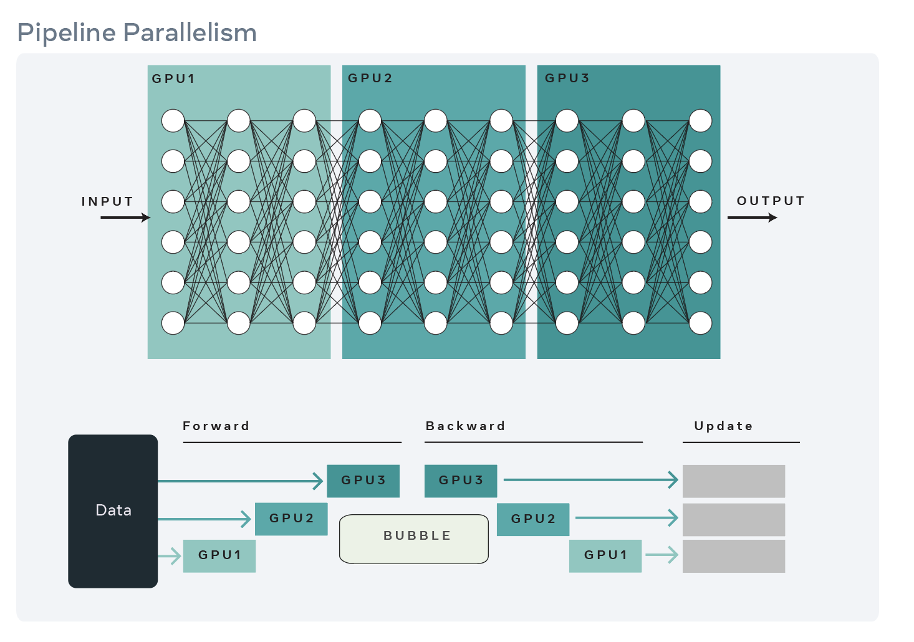

Pipeline Parallelism
=====================

Training large models can lead to out-of-memory when the size of the model is too large for a single GPU.
To train such a large model, layers can be pipelined across different GPU devices as described in GPipe.
The `fairscale.nn.Pipe` is an implementation of GPipe which has been adopted from torchgpipe. This API
has also been upstreamed to PyTorch in the 1.8 release with the experimental tag.

Gpipe first shards the model across different devices where each device hosts a shard of the model.
A shard can be a single layer or a series of layers. However Gpipe splits a mini-batch of data into
micro-batches and feeds it to the device hosting the first shard. The layers on each device process
the micro-batches and send the output to the following shard/device. In the meantime it is ready to
process the micro batch from the previous shard/device. By pipepling the input in this way, Gpipe is
able to reduce the idle time of devices.

Best practices for using `fairscale.nn.Pipe`
^^^^^^^^^^^^^^^^^^^^^^^^^^^^^^^^^^^^^^^^^^^^

1. Choice of size of micro-batches can affect GPU utilization. A smaller microbatch can reduce latency of shards waiting for previous shard outputs but a large microbatch better utilizes GPUs.

2. Sharding the model can also impact GPU utilization where layers with heavier computation can slow down the shards downstream.
