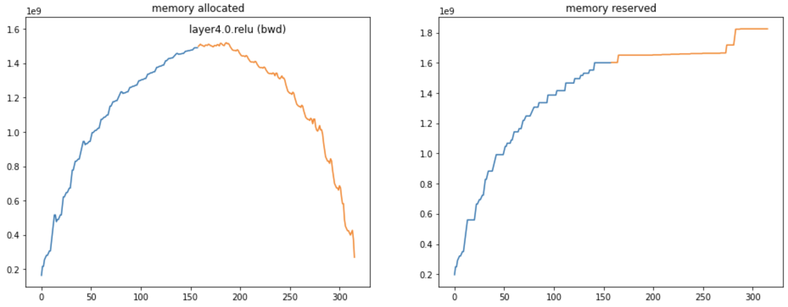
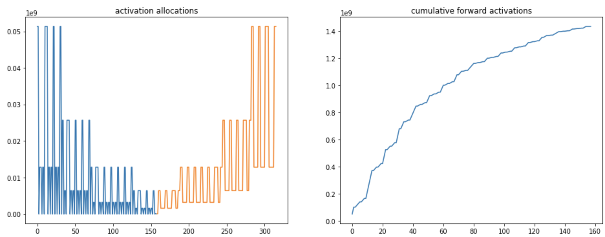
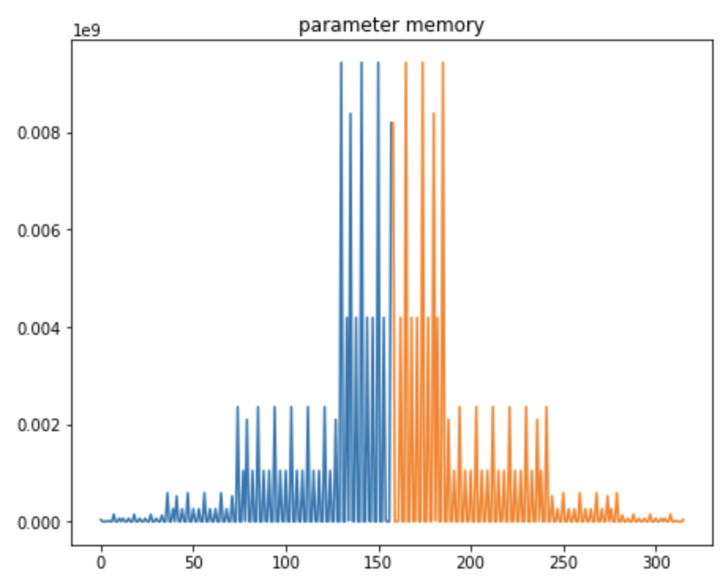
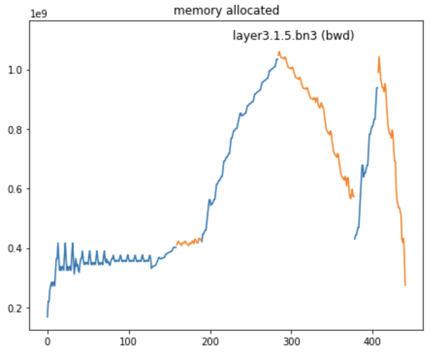
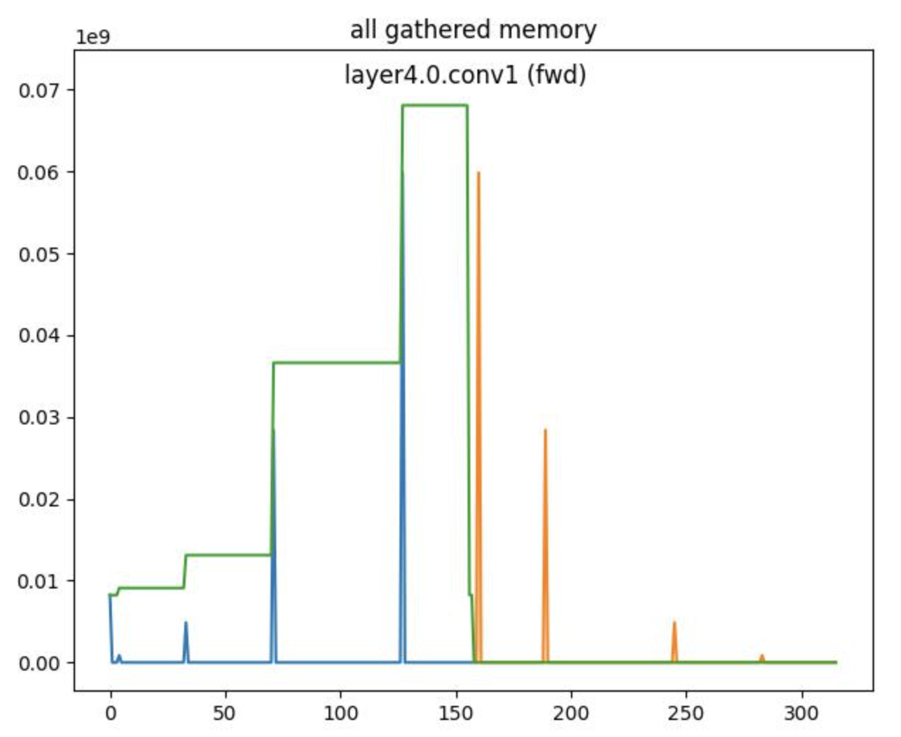

Tooling to diagnose and fix memory problems
===========================================

FairScale comes with some experimental tooling to help track, visualize and suggest fix for memory issues occurring during the forward/backward pass of your models.

Visualizing the memory profile
------------------------------

To track and visualize the memory profile of a model, you can use the `LayerwiseMemoryTracker`:

.. code-block:: python

    from fairscale.experimental.tooling.layer_memory_tracker import LayerwiseMemoryTracker
    import torch
    import torchvision.models

    # Create a model
    model = torchvision.models.resnet50().cuda()
    criterion = torch.nn.CrossEntropyLoss()

    # Create some dummy inputs
    batch_size = 16
    x = torch.randn(size=(batch_size, 3, 224, 224)).cuda()
    y = torch.tensor(list(range(batch_size)), dtype=torch.int64).cuda()

    # Start monitoring the model
    tracker = LayerwiseMemoryTracker()
    tracker.monitor(model)

    # Do a forward/backward with dummy inputs
    criterion(model(x), y).backward()

    # Stop monitoring the model
    tracker.stop()

    # Show some useful default plots
    tracker.show_plots()

The resulting graphs will include:

- a graph of the memory profile (memory allocated and reserved) during the forward/backward

- a graph of the amount of memory allocations done for activations done during the forward/backward

- a graph of the amount of memory used for parameters by each the layers traversed done during the forward/backward

In all these graphs:

- the blue part of the curve is used for the forward pass, the orange for the backward pass
- the X axis is only used for ordering of the computational steps (it does not represent the index of the layer in the model)

How to use those graphs?
------------------------

It is not always obvious to understand how much memory a model will be using. Those graphs allows to visualize:

- what is the main cause of memory consumption: this would be memory activations in the graph above
- what are the layers that are worth sharding: those at the end of the convolution net as in the case above
- where should we place activation checkpoints to diminish memory consumption

If those graphs are not useful to you, you can always use the raw data collected by the `LayerwiseMemoryTracker` instead,
or use any of the other utility functions provided in the tool:

.. code-block:: python

    # Access all raw traces / forward traces only / backward traces only
    tracker.memory_traces
    tracker.forward_traces
    tracker.backward_traces

    # Access a quick summary of the traces with information on:
    # - the peak memory usage
    # - the top layers in terms of memory consumption
    tracker.summary

Activation checkpoint suggestions
---------------------------------

In additional to visualisation, the `LayerwiseMemoryTracker` traces can be used to suggest activation checkpoints
locations, which can be used to reduce the memory consumption of the forward/backward, but trading some compute:

.. code-block:: python

    from fairscale.experimental.tooling.layer_memory_tracker import suggest_checkpoint_location

    suggestion = suggest_checkpoint_location(tracker.memory_traces, num_checkpoints=0)
    print(suggestion.max_memory)      # Outputs: 1435630080

    suggestion = suggest_checkpoint_location(tracker.memory_traces, num_checkpoints=2)
    print(suggestion.max_memory)      # Outputs: 485095936
    print(suggestion.split_modules)   # Outputs: ['layer1.1.bn3', 'layer2.2.conv3']

This sample code tells us that we can reduce the memory consumption due to activations from 1.4G to around 500M by
checkpointing activations at the locations `layer1.1.bn3` and `layer2.2.conv3`.

These locations can serve as first guesses and might not always be practical due to the model code. In the case of a
torchvision resnet, we can adapt those locations by trying to checkpoint around layer1 and layer2:

.. code-block:: python

    model = torchvision.models.resnet50().cuda()
    model.layer1 = checkpoint_wrapper(model.layer1)
    model.layer3 = checkpoint_wrapper(torch.nn.Sequential(model.layer2, model.layer3))
    model.layer2 = torch.nn.Identity()

Leading to the following memory profile, saving around 400MB of activation memory at the cost of more compute:

Dedicated features to FSDP distributed training
-----------------------------------------------

When training a big model with `FullyShardedDataParallel`, you can use the `LayerwiseMemoryTracker` to track the
amount of memory exchanged by FSDP to consolidate sharded layers:

.. code-block:: python

    from fairscale.nn import FullyShardedDataParallel as FSDP
    from fairscale.experimental.tooling.layer_memory_tracker import ProcessGroupTracker

    # Create a process group for FSDP
    group = torch.distributed.new_group()
    group = ProcessGroupTracker(group)

    # Create a FSDP model
    model = torchvision.models.resnet50().cuda()
    model.layer1 = FSDP(model.layer1, process_group=group)
    model.layer2 = FSDP(model.layer2, process_group=group)
    model.layer3 = FSDP(model.layer3, process_group=group)
    model.layer4 = FSDP(model.layer4, process_group=group)
    model = FSDP(model, process_group=group)

Now, the `LayerwiseMemoryTracker` will provide an additional graph where we can see:

- the memory spikes (in blue for forward, in orange for backward) of the `all_gather` calls
- an estimation (in green) of cumulative parameter memory (only available for the forward pass)

Limitations
------------

The `LayerwiseMemoryTracker` has a bunch of limitations it is important to be aware of:

1. It only works on GPU models: models cannot sit on the CPU
2. Some of the GPU memory might not tracked by PyTorch (for example some NCCL buffers) and therefore will not be tracked with this tooling either
3. Beside memory allocated and memory cached, which are based on PyTorch, the results are based on heuristics, and might miss some memory in some cases
4. Some features (such as cumulative all gathered memory for FSDP) do not work in the backward pass
