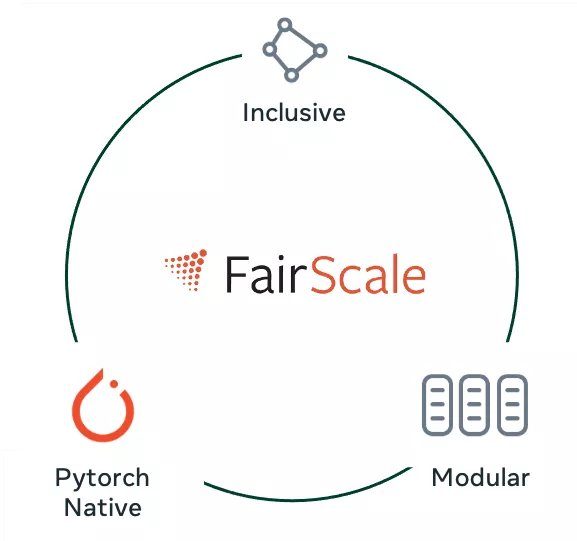
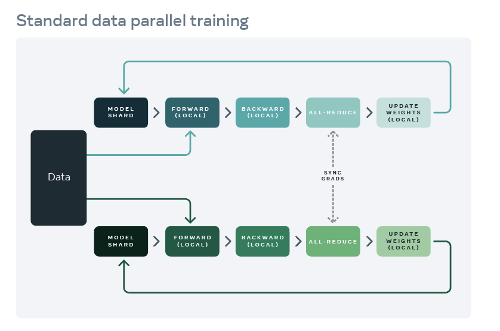

What is FairScale?
====================

FairScale is a PyTorch extension library for high performance and large scale training.
This library extends basic PyTorch capabilities while adding new SOTA scaling techniques.
FairScale makes available the latest distributed training techniques in the form of composable
modules and easy to use APIs. These APIs are a fundamental part of a researcher's toolbox as
they attempt to scale models with limited resources.

FairScale was designed with the following values in mind:

1. **Usability** -  Users should be able to understand and use FairScale APIs with minimum cognitive overload.

2. **Modularity** - Users should be able to combine multiple FairScale APIs as part of their training loop seamlessly.

3. **Performance** - FairScale APIs provide the best performance in terms of scaling and efficiency.

ML training at scale traditionally means `data parallelism <https://pytorch.org/tutorials/intermediate/ddp_tutorial.html>`_
which allows us to use multiple devices at the same
time to train a large batch size per step thereby achieving the goal accuracy in a shorter period of time
as compared to training on a single device. With recent advances in ML research, the size of ML models
has only increased over the years and data parallelism no longer serves all “scaling” purposes.

There are multiple axes across which you can scale training and FairScale provides the following broad
categories of solutions:

1. **Parallelism** → These techniques allow scaling of models by layer parallelism and tensor parallelism.

2. **Sharding Methods** → Memory and computation are usually trade-offs and in this category we attempt to achieve both low memory utilization and efficient computation by sharding model layers or parameters, optimizer state and gradients.

3. **Optimization** → This bucket deals with optimizing memory usage irrespective of the scale of the model, training without hyperparameter tuning and all other techniques that attempt to optimize training performance in some way.
